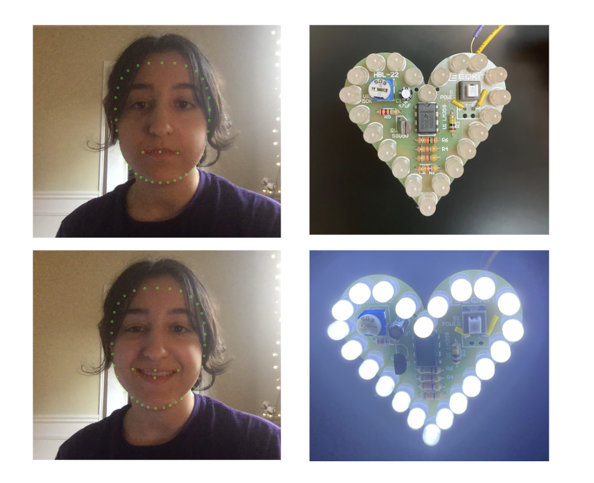

# Smile Heart Detector

Program that detects whether a person is smiling using [MediaPipe](https://google.github.io/mediapipe/) to control a heart-shaped LED

## Result

### Tools
- Face mesh points obtained from [mapped image](https://i.stack.imgur.com/5Mohl.jpg)
- Arduino connection implemented with [pyFirmata](https://pypi.org/project/pyFirmata/)